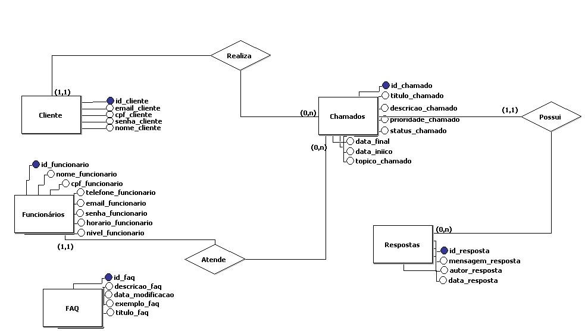
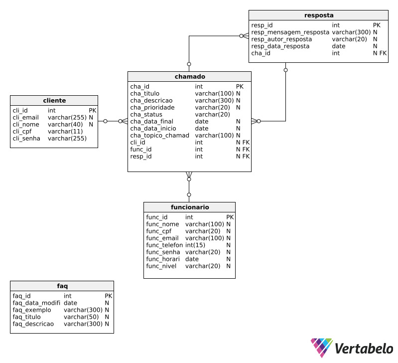

<h1>Primeira Sprint</h1>

<h2>  Índice</h2>

- [Valor da Sprint](#valor)
- [DoR (Definition of Ready)](#dor)
- [DoD (Definition of Done)](#dod)
- [Sprint Backlog](#backlog)
- [Banco de Dados](#bancodedados)
- [Burndown](#burndown)
- [Tasks](#tasks)
- [Vídeo demonstrativo do Wireframe](#video)
  
 

<h2> Valor da Sprint</h2>

Levantar requisitos e mostrar uma prévia do produto para que o cliente acompanhe o desenvolvimento e dê seu feedback

 

<h2> DoR (Definition of Ready) </h2>

### Sprint 1

- Levantamento de requisitos ✔

- Planejamento para a sprint ✔

 

<h2> DoD (Definition of Done) </h2>

- Product Backlog ✔

- Sprint backlog ✔

- Modelagem de dados ✔

- Protótipo ✔

 

<h2> Sprint Backlog </h2> 

| Rank | Prioridade | Tarefa | Estimativa |
| --- | --- | --- | --- |
| 1 | Alta | Criação do protótipo navegável | 24 horas |
| 2 | Alta | Desenvolvimento do Product Backlog | 10 horas |
| 3 | Alta | Desenvolvimento do Sprint Backlog | 3 horas |
| 4 | Alta | Documentação do projeto no Git | 8 horas |
| 5 | Alta | Desenvolvimento do modelo conceitual do Banco de Dados | 5 horas |
| 6 | Médio | Conversão do modelo conceitual para o lógico | 5 horas |
| 7 | Médio  | Estudo do sistema de atendimento ao cliente | 4 horas |
| 8 | Baixa | Estudo de TypeScript | 6 horas |

 

<h2> Burndown Chart </h2><a name="burndown">

 

<h2> Modelo do Banco de Dados </h2><a name="bancodedados">

### Conceitual

### Lógico

<h2> Tarefas </h2>

### User Story 1:

- Tarefa: Como cliente, desejo utilizar um sistema de cadastro para acessar os recursos disponíveis do website.

  - Critérios de Aceitação:

     - O sistema de cadastro deve permitir que um cliente se registre com sucesso.
     - O cliente deve poder acessar os recursos do website após o registro.
     - As informações fornecidas durante o cadastro devem ser armazenadas corretamente no sistema.

  - Cenário:

    - Cliente acessa a página de cadastro.
    - Preenche os campos obrigatórios (nome, e-mail, senha, cpf).
    - Clica no botão de registro.
    - Recebe uma confirmação de que o registro foi bem-sucedido por meio de pop-up.
    - Tenta acessar os recursos do website e consegue com sucesso.

### User Story 2:

- Tarefa: Como administrador, desejo registrar atendentes com seu tipo de serviço no sistema.

  - Critérios de Aceitação:

     - O sistema deve permitir que o administrador realize o cadastro de atendentes.
     - Os atendentes devem ser associados ao seu tipo de serviço prestado.

  - Cenário:

     - Adminitrador acessa a pagina de adicionar novo atendente.
     - Preenche os campos obrigatorios, incluindo o seu tipo de serviço.
     - Recebe uma confirmação de novo Atendente cadastrado.

### User Story 3:

- Tarefa: Como cliente, desejo ter a possibilidade de visualizar e editar as informações de minha conta para mantê-la atualizada.

  - Critérios de Aceitação:

     - O sistema deve fornecer uma interface para que o cliente possa visualizar suas informações.
     - O sistema deve permitir modificações como nome, e-mail e senha do usuario.
     - O sistema deve informar que os dados foram atualizados caso tenha alguma alteração.
     - Após a edição, o sistema deve garantir o armazenamento seguro das modificações.

  - Cenários:

     - O usuario realiza login no sistema.
     - O usuario entra na página minha conta.
     - Visualiza as informações existentes.
     - Clica no botão de editar conta.
     - Modifica os campos desejados.
     - Verifica se as informações foram atualizadas com sucesso.

### User Story 4:

- Tarefa: Como administrador, desejo poder visualizar e gerenciar todos os atendentes cadastrados no sistema, incluindo a capacidade de editar informações.

  - Critérios de Aceitação:

     - O sistema deve possuir uma interface para que o administrador possa ver todos os atendentes.
     - O administrador pode editar todos os atendentes cadastrados.
     - Após editada, as informações dos atendentes devem ser refletidas corretamente no sistema.
     - Somente o administrador pode editar informações dos atendentes.

  - Cenários:

     - O administrador navega até a pagina de gerenciar atendentes.
     - O adminitrador visualiza todos os atendentes cadastrados.
     - O adminitrador seleciona o atendente desejado para ver suas informações.
     - Edita as informções necessarias.
     - Verifica se as informações foram salvas no sistema.
     - Apenas o administrador pode acessar a pagina de gerenciamento de atendentes.

### User Story 5:

- Tarefa: Como cliente, desejo realizar login no sistema utilizando e-mail e senha.

  - Critérios de Aceitação:

     - O sistema deve possuir um formulário onde deve se colocar o e-mail e senha.
     - O cliente pode enviar esse formulário de login.
     - O sistema realiza a autenticação de usuário.
     - O sistema deve redirecionar o usuário em caso de sucesso para a pagina principal.
     - Em caso de falha, deverá aparecer uma mensagem contendo o motivo do erro.

  - Cenários:

     - O cliente navega até a pagina de login.
     - Insere e-mail e senha.
     - clica no botão de login.
     - O sistema valida as informações
     - Se sucesso, então o cliente é direcionado para a pagina home.
     - Se ocorrer um erro, deve aparecer uma mensagem contendo o motivo do erro.
     - O cliente tenta novamente com as credencias corretas, se sucesso então ele é redirecionado.

### User Story 6:

- Tarefa: Como atendente, desejo realizar login no sistema utilizando CPF e senha.

  - Critérios de Aceitação:

     - O sistema deve possuir um formulário onde é necessario inserir e-mail e senha.
     - O atendente pode enviar esse formulário de login.
     - O sistema realiza a autenticação de usuário.
     - O sistema deve redirecionar o usuário em caso de sucesso para a pagina principal.
     - Em caso de falha, deve-se aparecer uma mensagem contendo o motivo do erro.

  - Cenários:

     - O atendente navega até a pagina de login.
     - Insere e-mail e a senha.
     - Clica no botão de login.
     - O sistema valida as informações
     - Se sucesso, então o atendente  é direcionado para a pagina home.
     - Se erro, deve aparecer uma mensagem contendo o motivo do erro.
     - O atendente tenta novamente com as credencias corretas, se sucesso então ele é redirecionado.

### User Story 7:

- Tarefa: Como administrador, desejo realizar login no sistema utilizando CPF e senha.

  - Critério de Aceitação:

     - O sistema deve possuir um formulário onde deve se colocar o e-mail e senha.
     - O administrador pode enviar esse formulário de login.
     - O sistema realiza a autenticação de usuário.
     - O sistema deve redirecionar o usuário em caso de sucesso para a pagina principal.
     - Em caso de falha, deve-se aparecer uma mensagem contendo o motivo do erro.

  - Cenários:

     - O administrador navega até a pagina de login.
     - Insere e-mail e a senha.
     - Clica no botão de login.
     - O sistema valida as informações
     - Se sucesso, então o administrador é direcionado para a pagina home.
     - Se erro, deve aparecer uma mensagem contendo o motivo do erro.
     - O administrador tenta novamente com as credencias corretas, se sucesso então ele é redirecionado.

### User Story 8:

- Tarefa: Como cliente, desejo selecionar um categoria em que se encaixa o meu problema para realizar o atendimento de forma mais específica.

  - Critério de Aceitação:

     - O sistema deve apresentar uma lista de categorias relevantes que representam os problemas comuns dos clientes.
     - O cliente deve poder selecionar um categoria que melhor descreva seu problema da lista fornecida.
     - Após selecionar o categoria, o cliente deve ter a opção de descrever o problema em um campo de texto caso necessario.
     - Após descrever o problema, o cliente deve poder enviar as informações para iniciar o atendimento.
     - O sistema deve registrar o categoria selecionado e a descrição do problema enviada pelo cliente para referência futura.

  - Cenários:

     - O cliente acessa a página de atendimento ou de abertura de chamados.
     - Visualiza a lista de tópicos relevantes apresentados pelo sistema.
     - Seleciona um categoria que corresponda ao seu problema.
     - Após selecionar o categoria, é apresentado um campo de texto para descrever detalhadamente o problema.
     - O cliente descreve seu problema no campo fornecido.
     - Clica no botão de enviar para submeter o problema ao sistema.
     - O sistema registra o categoria selecionada e a descrição do problema associada ao cliente.
     - O cliente verifica se o problema foi submetido corretamente recebendo uma confirmação de envio.

### User Story 9:

- Tarefa: Como cliente, desejo visualizar todos os meus chamados abertos e seus status.

  - Critérios de Aceitação:

     - O sistema deve fornecer uma seção de tickets onde o cliente possa escolher entre visualizar os chamados ativos, todos os chamados e criar um novo chamado.
     - Para cada chamado ativo, o sistema deve exibir seu número de identificação, título e status atual.
     - Os chamados ativos devem estar disponíveis em uma página separada dos chamados fechados.
     - O cliente deve poder acessar a página de chamados fechados para visualizar o histórico completo quando necessário.
     - O sistema deve permitir ao cliente alternar facilmente entre as páginas de chamados ativos e fechados.
     - O cliente deve poder atualizar a página ou solicitar uma atualização para ver o status mais recente de seus chamados ativos.

  - Cenários:

     - O cliente faz login na sua conta.
     - Navega até a seção de tickets.
     - Na seção de tickets, o cliente pode escolher entre três opções: "Tickets Ativos", "Todos os Tickets" e "Criar Novo Ticket".
     - O cliente seleciona "Tickets Ativos".
     - Visualiza uma lista de todos os seus chamados ativos, incluindo o número de identificação, título e status atual de cada um.
     - Se necessário, o cliente pode entrar no chat.
     - O cliente pode acessar a página de chamados fechados para visualizar o histórico completo quando desejar.
     - O cliente pode alternar facilmente entre as páginas de chamados ativos e fechados.

### User Story 10:

- Tarefa: Como atendente, desejo visualizar os chamados que não foram resolvidos por ordem de prioridade para solucioná-los mais rapidamente.

  - Critérios de Aceitação:

     - O sistema deve fornecer uma seção onde o atendente possa visualizar os chamados não resolvidos.
     - Os chamados não resolvidos devem ser ordenados por ordem de prioridade, com os mais prioritários exibidos primeiro.
     - Para cada chamado não resolvido, o sistema deve exibir seu número de identificação, título, prioridade e status atual.
     - O atendente deve poder acessar cada chamado não resolvido para ver mais detalhes e tomar ações necessárias para resolvê-lo.
     - O sistema deve permitir ao atendente atualizar a página ou solicitar uma atualização para ver os chamados não resolvidos mais recentes.

  - Cenário:

     - O atendente faz login na sua conta.
     - Navega até a seção de chamados não resolvidos.
     - Visualiza uma lista de chamados não resolvidos, ordenados por prioridade.
     - Para cada chamado, verifica o número de identificação, título, prioridade e status atual.
     - Clica em um chamado para ver mais detalhes e tomar ações necessárias para resolvê-lo.

### User Story 11:

- Tarefa: Como atendente, desejo visualizar os atendimentos realizados por mim e seus status.

  - Critério de Aceitação:

     - O sistema deve fornecer uma seção onde o atendente possa visualizar os atendimentos realizados por ele.
     - Para cada atendimento realizado pelo atendente, o sistema deve exibir seu número de identificação, título e status atual.
     - Os atendimentos realizados pelo atendente devem ser apresentados de forma clara e organizada, permitindo identificar facilmente cada um.
     - O atendente deve poder acessar cada atendimento para ver mais detalhes, se necessário.

  - Cenário:

     - O atendente faz login na sua conta.
     - Navega até a seção de histórico de atendimento.
     - Visualiza uma lista de atendimentos realizados por ele, incluindo o número de identificação, título e status atual de cada um.

### User Story 12:

- Tarefa: Como cliente, quero abrir um chat para me comunicar com o atendente.

  - Critério de Aceitação:

     - O sistema deve possuir uma interface em que o cliente possa se comunicar com o atendente de forma clara.

  - Cenário:

     - O cliente faz login.
     - O cliente entra em um chamado que esta aberto.
     - Encontra a opção de entrar no chat.
     - Visualiza a reposta do atendente.
     - Se ele precisar de mais assistência ou tiver outras duvidas ele pode continuar a conversa com o atendente.

### User Story 13:

- Tarefa: Como atendente, quero abrir um chat para me comunicar com o cliente.

  - Critério de Aceitação:

     - O sistema deve possuir uma interface clara que permita ao atendente abrir um chat com o cliente de forma direta para solucionar o problema.
     - Deve haver uma opção para o atendente encerrar o chat quando a comunicação for concluída.

  - Cenário:

     - O atendente faz login na sua conta.
     - Acessa a seção de tickets, onde seleciona por prioridade o ticket que vai atender.
     - O sistema abre uma janela de chat onde o atendente pode enviar mensagens ao cliente.
     - O atendente cumprimenta o cliente e se coloca à disposição para ajudar.
     - A comunicação continua no chat até que o atendente encerre o chat.
     - Se o atendente resolver o problema ou tirar as dúvidas do cliente, ele tem a opção de encerrar o chat.
     - Se o cliente precisar de mais assistência ou tiver outras perguntas, a comunicação pode continuar no chat.

### User Story 14:

- Tarefa: Como administrador, quero que cada problema tenha um tempo de resposta definido para saber qual deve ser priorizado.

  - Critério de Aceitação:

  - O sistema deve calcular um tempo esperado para cada problema.
  - O sistema deve destacar e sinalizar os chamados de acordo com seu tempo para que não exceda o tempo de reposta definido.

  - Cenário:

     - O administrador faz login na sua conta.
     - Acessa a seção de gerenciamento de tickets ou chamados.
     - Visualiza os tickets ordenados de acordo com sua prioridade.
     - O sistema destaca ou sinaliza os tickets de acordo com o tempo esperado de resposta para cada um.
     - Se houver dois tickets com prioridade alta, o sistema prioriza aquele que está esperando há mais tempo.
     - O administrador pode revisar a lista de tickets e tomar decisões com base na priorização feita pelo sistema.
     - Garante que os tickets sejam tratados de forma eficiente, minimizando o tempo de espera dos clientes e mantendo a qualidade do serviço.

### User Story 15:

- Tarefa: Como cliente, desejo um FAQ com possíveis soluções para poder resolver problemas frequentes.

  - Critério de Aceitação:

     - O sistema deve fornecer uma seção de FAQ (Frequently Asked Questions) acessível aos clientes.
     - O FAQ deve conter uma lista de perguntas frequentes relacionadas aos problemas mais comuns enfrentados pelos clientes.
     - Para cada pergunta frequente, o FAQ deve fornecer uma resposta clara e detalhada que ajude o cliente a resolver o problema.
     - O FAQ deve ser organizado de forma clara e intuitiva, permitindo aos clientes encontrar facilmente as respostas para suas dúvidas.
     - Deve haver uma opção para os clientes entrarem em contato com o suporte caso não encontrem a solução para seu problema no FAQ.

  - Cenário:

     - O cliente acessa o sistema e navega até a seção de perguntas frequentes.
     - Encontra a seção de FAQ e entra nela.
     - Visualiza uma lista de perguntas frequentes sobre problemas comuns.
     - Seleciona uma pergunta que corresponda ao seu problema atual.
     - Lê a resposta fornecida e verifica se ela resolve o seu problema.
     - Se a resposta resolve o problema, o cliente segue as instruções fornecidas no FAQ.
     - Se a resposta não resolver o problema, o cliente pode entrar em contato com o suporte para obter assistência adicional.

### User Story 16:

- Tarefa: Como atendente, desejo poder alterar o status de um chamado entre "aberto", "em atendimento" e "finalizado", para acompanhar e gerenciar o progresso dos chamados de forma eficiente.

  - Critério de Aceitação:

     - O sistema deve fornecer uma interface para os atendentes alterarem o status de um chamado.
     - Os status disponíveis para seleção devem incluir "aberto", "em atendimento" e "finalizado".
     - Ao alterar o status de um chamado para "em atendimento", o sistema deve registrar a data e hora em que o atendimento começou.
     - Ao alterar o status de um chamado para "finalizado", o sistema deve registrar a data e hora em que o atendimento foi concluído.
     - Deve haver uma opção para adicionar comentários ou notas ao alterar o status de um chamado, permitindo registrar informações relevantes sobre o progresso do atendimento.
     - O sistema deve garantir que apenas os atendentes autorizados tenham permissão para alterar o status de um chamado.

  - Cenário:

     - O atendente faz login na sua conta.
     - Seleciona um chamado para o qual deseja atender e alterar o status.
     - Encontra a opção para alterar o status e escolhe entre "aberto", "em atendimento" ou "finalizado".
     - Se selecionar "em atendimento", o atendente adiciona um comentário informando que o atendimento começou.
     - Se selecionar "finalizado", o atendente adiciona um comentário informando que o atendimento foi concluído.
     - Confirma a alteração de status do chamado.
     - O sistema registra a data e hora da alteração de status, bem como quaisquer comentários adicionados pelo atendente.
     - Verifica se o status do chamado foi atualizado corretamente e se todas as informações relevantes foram registradas.

### User story 17:

- Tarefa: Como administrador, desejo gerar relatórios sobre tópicos mais abordados para gerenciar melhor.

  - Critérios de Aceitação:

     - O sistema deve permitir a geração de relatórios sobre os tópicos mais abordados pelos clientes.
     - Os relatórios devem incluir a apresentação de gráficos que representem visualmente a frequência de cada tópico.
     - Deve haver opção para filtrar os relatórios por período de tempo.

  - Cenário:

     - O administrador acessa o painel de administração do sistema.
     - Navega até a seção de relatórios.
     - Seleciona a opção para gerar relatórios sobre tópicos mais abordados.
     - Escolhe o período de tempo desejado para o relatório.
     - O sistema processa os dados e apresenta um relatório com os tópicos mais abordados durante o período selecionado, incluindo gráficos representativos.
     - O administrador analisa o relatório para entender as demandas mais frequentes dos clientes.
     - Com base nas informações do relatório, o administrador pode tomar decisões para melhorar os serviços ou ajustar o atendimento conforme necessário.

### User Story 18:

- Tarefa: Como administrador, desejo direcionar um atendimento para o suporte que esteja disponível.

  - Critérios de Aceitação:

     - O sistema deve permitir que o administrador encaminhe um atendimento para um membro da equipe de suporte disponível.
     - Deve haver uma funcionalidade para verificar a disponibilidade dos membros da equipe de suporte.
     - Ao direcionar um atendimento, o sistema deve notificar o membro da equipe de suporte selecionado.
     - Deve haver um registro do encaminhamento do atendimento, incluindo data, hora e membro da equipe de suporte responsável.

  - Cenário:

     - O administrador acessa o painel de administração do sistema.
     - Navega até a seção de gerenciamento de atendimentos.
     - Seleciona um atendimento que precisa ser encaminhado para o suporte.
     - Verifica a disponibilidade dos membros da equipe de suporte.
     - Seleciona um membro da equipe de suporte disponível para encaminhar o atendimento.
     - Confirma o encaminhamento do atendimento.
     - O sistema notifica o membro da equipe de suporte selecionado sobre o novo atendimento.

### User Story 19:

- Tarefa: Como administrador, quero poder cadastrar soluções para problemas comuns.

  - Critério de Aceitação:

     - O sistema deve fornecer uma funcionalidade para o administrador cadastrar soluções para problemas comuns enfrentados pelos clientes.
     - Deve haver uma interface clara e intuitiva para o cadastro de soluções.
     - Cada solução cadastrada deve incluir um título, uma descrição detalhada do problema e a solução recomendada.
     - O sistema deve permitir a associação de uma ou mais categorias a cada solução cadastrada, facilitando a organização e pesquisa.
     - Deve ser possível editar e excluir soluções cadastradas, caso necessário.
     - As soluções cadastradas devem estar disponíveis para consulta pelos atendentes e clientes, a fim de ajudar na resolução de problemas.

  - Cenário:

     - O administrador faz login na sua conta de administrador.
     - Acessa a seção de cadastro de soluções para problemas comuns.
     - Preenche os campos necessários, incluindo título, descrição do problema e solução recomendada.
     - Confirma o cadastro da solução.
     - Verifica se a solução cadastrada está disponível na lista de soluções.
     - Se necessário, o administrador pode editar ou excluir uma solução cadastrada.
     - Os atendentes e clientes podem acessar a lista de soluções cadastradas para encontrar ajuda na resolução de problemas comuns.

<h2> Vídeo demonstrativo </h2>
<!--   -->

 Em desenvolvimento 

